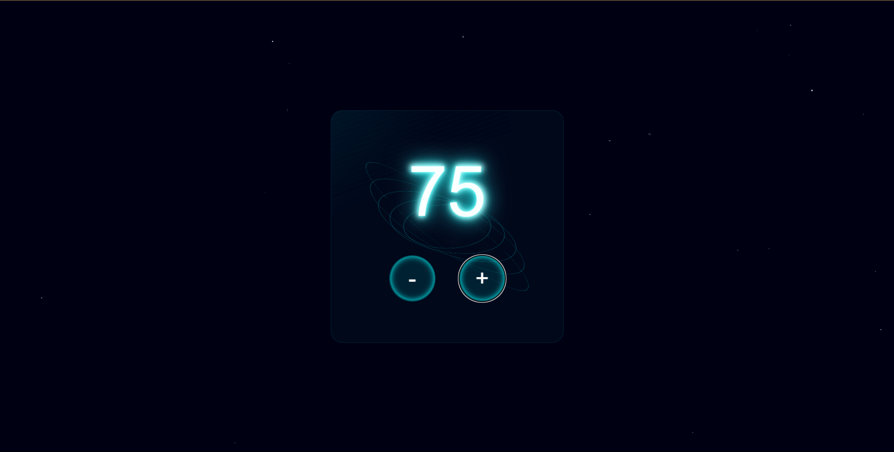

# Futuristic Counter 🚀

An interactive counter with a futuristic design featuring sci-fi visual effects, including an animated starry background and reactive 3D interface.

[](./public/image/screen.png)

## Features ✨

- Futuristic design with neon effects
- 3D animated starry background
- Mouse-responsive interface
- Smooth number transitions
- Responsive design

## Live URL 🌐

- https://counter-space-project-xyz.web.app
- https://counter-space-project-xyz.firebaseapp.com

## Usage 💻

- Click '+' to increment
- Click '-' to decrement
- Move mouse for 3D effect

## Customization 🎨

Modify CSS variables in the `style.css` file:

```css
:root {
  --neon-color: #0ff; /* Neon effects color */
  --bg-dark: #000013; /* Background color */
  --highlight: #fff; /* Text color */
}
```

## Tech Stack 🔧

- HTML5
- CSS3 (Animations and 3D effects)
- Vanilla JavaScript

## License 📄

[MIT](./LICENSE)

---

_Developed with ❤️ by Matteo Ratto_
